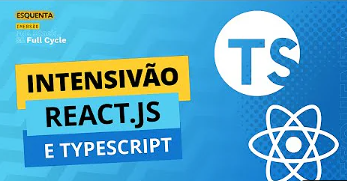

### Getting Started with Create React App

- Course reference: 
  - [React JS Curso Rápido ⚛️ Masterclass #1 2020 - 100% Prático!](https://youtu.be/XQxitgyZ_S4) (done)
  - [React JS Curso Rápido ⚛️ Masterclass #2 2020 - 100% Prático!](https://www.youtube.com/watch?v=GJ8Vm-h0V8I) (wip)
- Elected style guide:
[Airbnb React/JSX Style Guide](https://github.com/airbnb/javascript/tree/master/react)
- This project was bootstrapped with: [Create React App](https://github.com/facebook/create-react-app)

create app
```
npx create-react-app react-fundamentals
```
run server
```
npm start
```
final visual result (master #1)
